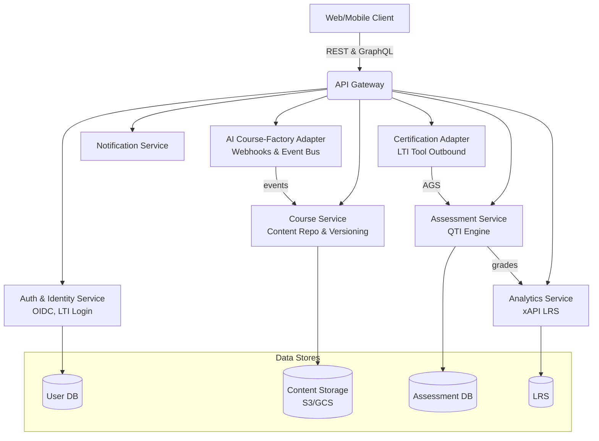
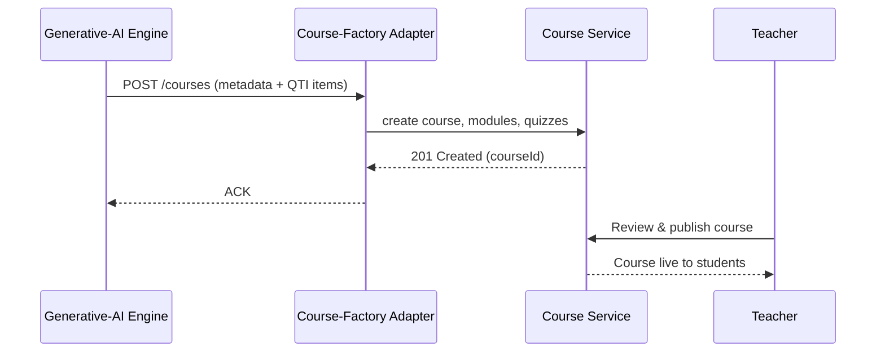
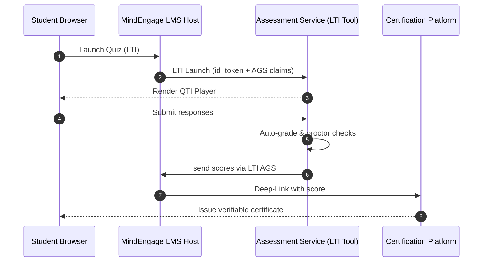

# MindEngage LMS

An AI-first Learning Management System by MindEngage with Canvas-like UX, native Generative-AI content pipelines, and full LTI/QTI/xAPI support.

---

## Table of Contents

- [Overview](#overview)  
- [Features](#features)  
- [Architecture](#architecture)  
- [Course Generation Flow](#course-generation-flow)  
- [Exam & Grading Flow](#exam--grading-flow)  
- [Standards & Integrations](#standards--integrations)  
- [Deployment & Extensibility](#deployment--extensibility)  
- [Contributing](#contributing)  

---

## Overview

MindEngage LMS lets your Generative-AI Course‐Factory publish real courses, modules, and quizzes directly into the system. Teachers can review and publish AI‐generated content; students take quizzes and exams with full proctoring hooks; and certification bodies integrate via LTI.

---

## Features

- **AI-Driven Content**: Automated import of courses, lessons, quizzes via REST/GraphQL.  
- **Rich Authoring**: Markdown/HTML editor with IMS Common Cartridge export.  
- **Assessments & Exams**: QTI 3.0 engine, randomized pools, proctoring.  
- **LTI 1.3 Advantage**: Deep-Linking, NRPS, AGS for certification & tool interoperability.  
- **Analytics**: xAPI statements to a Learning Record Store (LRS).  
- **User Management**: OneRoster import, role-based enrollments.  
- **Accessibility**: WCAG 2.2 AA, WAI-ARIA.  
- **Notifications & Calendar**: In-app + email + iCal feeds.  
- **Extensible Plugin SDK**: Webhooks & serverless functions (WASM/Node).

---

## Architecture

## Course Generation Flow

## Exam & Grading Flow

## Standards & Integrations

| Area                 | Standard / Spec             |
| -------------------- | --------------------------- |
| Course Packaging     | IMS Common Cartridge v1.3   |
| Assessments          | QTI 3.0                     |
| Analytics            | xAPI (Experience API)       |
| Rosters & SIS        | OneRoster v1.2              |
| Tool Launch & Grades | LTI 1.3 Advantage           |
| Authentication       | OAuth 2.1 / OIDC / SAML 2.0 |
| Accessibility        | WCAG 2.2 AA, WAI-ARIA       |

## Deployment & Extensibility

* Infrastructure: Kubernetes + PostgreSQL + Redis + Kafka/NATS + S3/GCS

* CI/CD: GitHub Actions → Helm charts → Canary rollouts

* Plugin SDK: Serverless webhooks (WASM/Node) on content events

* Theming: React + Tailwind UI, CSS variables for branding

## Contributing

1. Fork the repo & create a feature branch.

2. Write Tests for any new behavior.

3. Submit a Pull Request with a clear description.

4. Ensure all CI checks pass (lint, build, tests).