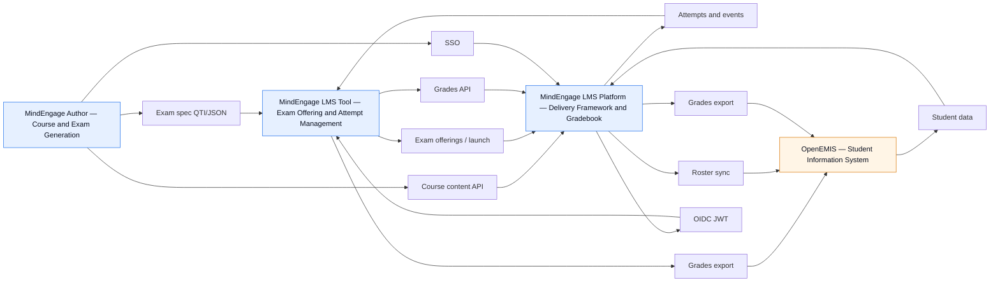

# MindEngage Education Framework

```mermaid
graph LR
  %% Classes
  classDef mindengage fill:#e6f0ff,stroke:#1f6feb,color:#0a0f1e,stroke-width:1px;
  classDef openemis fill:#fff5e6,stroke:#d97706,color:#0a0f1e,stroke-width:1px;

  MEAuthor[MindEngage Author — Course and Exam Generation]
  LMSTool[MindEngage LMS Tool — Exam Offering and Attempt Management]
  LMSPlatform[MindEngage LMS Platform — Delivery Framework and Gradebook]
  OpenEMIS[OpenEMIS — Student Information System]

  %% Apply classes
  class MEAuthor,LMSTool,LMSPlatform mindengage
  class OpenEMIS openemis

  QTI[Exam spec QTI/JSON]
  CourseAPI[Course content API]
  Launch[Exam offerings / launch]
  Events[Attempts and events]
  GradesAPI[Grades API]
  GradesExport[Grades export]
  Roster[Roster sync]
  GradesExport2[Grades export]
  StudentData[Student data]
  SSO[SSO]
  OIDC[OIDC JWT]

  MEAuthor --> QTI --> LMSTool
  MEAuthor --> CourseAPI --> LMSPlatform

  LMSTool --> Launch --> LMSPlatform
  LMSPlatform --> Events --> LMSTool

  LMSTool --> GradesAPI --> LMSPlatform
  LMSTool --> GradesExport --> OpenEMIS

  LMSPlatform --> Roster --> OpenEMIS
  LMSPlatform --> GradesExport2 --> OpenEMIS
  OpenEMIS --> StudentData --> LMSPlatform

  MEAuthor --> SSO --> LMSPlatform
  LMSPlatform --> OIDC --> LMSTool


```