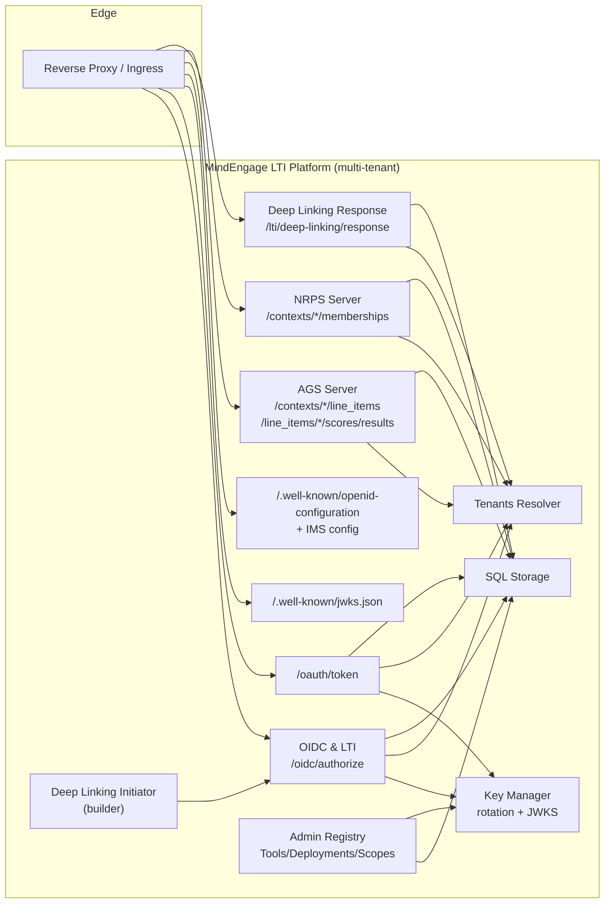

# MindEngage **LTI Platform** — Architecture (MVP → GA)

> This document describes the **MindEngage LTI Platform** service — an IMS/1EdTech-compliant *Platform* that issues LTI launches, hosts AGS/NRPS, and manages Tools/Deployments across many tenants (schools/districts).
> The **MindEngage LMS** (the learning app students use) is documented separately.

---

## 1) What the Platform Is

* A **multi-tenant LTI 1.3 Advantage Platform** (Issuer) that:

  * **Issues launches** (OIDC `authorize` → `id_token` with LTI claims)
  * **Mints OAuth tokens** (`/oauth/token`) for Tools (client\_credentials & private\_key\_jwt)
  * **Serves JWKS** for its signing keys (key rotation, per-tenant)
  * **Provides Advantage services** to Tools:

    * **AGS** (Assignment & Grade Services): Line Items, Scores, Results
    * **NRPS** (Names & Role Provisioning Service): Memberships
  * **Deep Linking**: initiates requests and accepts responses (resource link creation)
  * **Admin registry**: Tools, deployments, scopes, key material, policies

---

## 2) What’s **Covered** in the current scaffold (MVP)

* **Core endpoints**

  * `/.well-known/openid-configuration` + IMS **platform configuration**
  * `/.well-known/jwks.json` (per tenant) — live, rotating keys
  * `/oidc/authorize` → **LTI id\_token** issuer (Launch + Deep Linking)
  * `/oauth/token` → OAuth2 **client\_credentials** & **private\_key\_jwt**
* **Advantage services**

  * **AGS**: LineItems (collection + item), Scores (POST), Results (GET)
  * **NRPS**: Context memberships (GET) with paging & role filters
* **Deep Linking**

  * **Request builder** (initiation URL to Tool)
  * **Response verifier** (Tool JWT → placements + optional LineItem hints)
* **Multi-tenancy**

  * Tenant resolver (host/path based), per-tenant issuer + signing keys
* **Key management**

  * In-process **KeyManager** (RS256): rotation window + JWKS overlap
* **Middleware**

  * AuthN (Bearer), **scope** guards, **replay** protection hooks, tenancy
* **Storage & migrations**

  * Schemas for platforms/tenants, tools, deployments, resource links, line items, grade sync status, user map, etc. (SQLite/Postgres)
* **Admin registry API (scaffold)**

  * CRUD for Tools, deployments, client creds, scopes; JWKS ingestion
* **Client SDK stubs**

  * Minimal AGS client (tool-side) + deep-link initiator helpers (platform-side)

> ✅ The above lets you stand up a **real LTI issuer** that can deep-link tools, launch them, and serve AGS/NRPS to those tools within/for a district.

---

## 3) High-Level Architecture

---

## 4) Data Model (condensed)

* **tenants**: id, issuer, display name, domains, status
* **keys**: per tenant KID, alg, validity window, RSA/ECDSA private (prod: externalize/harden)
* **tools**: client\_id, label, login initiation URL, redirect URIs, logo, contact
* **tool\_credentials**: client\_id, secret hash (optional), JWKS (for private\_key\_jwt)
* **deployments**: (tenant×tool) deployment\_id, scopes policy
* **resource\_links**: (tenant×context×tool) title, target URL, custom params
* **line\_items**: (tenant×context×resource\_link) label, max, item URL
* **nrps**: membership snapshots (or views backed by SIS if integrated)
* **grade\_sync**: attempt id, status, retries, last\_error (when Platform needs to store results)
* **audit/events**: security, admin actions, DL placements

(Your repo already includes close equivalents via `pkg/platform/storage/migrations.go` & related store packages.)

---

## 5) Primary Flows

### 5.1 LTI Launch (as Platform)

1. **Deep Linking** (teacher):

   * Platform → Tool **login initiation** (build URL)
   * Tool → Platform `/oidc/authorize` → Platform returns **id\_token** with `message_type=LtiDeepLinkingRequest`
   * Tool returns **Deep Linking Response** (signed JWT) → Platform verifies, persists **resource links** (+ optional LineItems)
2. **Resource launch** (student/teacher):

   * LMS UI opens tool link → Platform `/oidc/authorize` → **id\_token** with `message_type=LtiResourceLinkRequest`
   * Tool consumes launch; calls Platform **NRPS**, **AGS** as needed.

### 5.2 OAuth Token (Tool → Platform)

* Tool presents **client\_credentials** (secret\_post or **private\_key\_jwt**) to `/oauth/token`
* Platform mints **Bearer JWT** access token with granted **scopes**.

### 5.3 AGS/NRPS

* Tool calls **LineItems** (list/create/update/delete), **Scores** (POST), **Results** (GET)
* Tool calls **NRPS memberships** (with role filters/pagination)

---

## 6) Security

* **Signing keys**: per-tenant, rotated; JWKS publishes active + overlap
* **Tokens**: JWT access tokens (short TTL), audience-bound (`/oauth/token`), scope-limited
* **Client auth**: `client_secret_post` (bcrypt) or **`private_key_jwt`** (RS256)
* **Replay protection**: optional store for `jti`/`nonce` in:

  * Deep Linking Response
  * private\_key\_jwt assertions
* **Scopes enforcement**: route middleware checks e.g. `ags:lineitem`, `ags:score`, `nrps:contextmembership.readonly`
* **Tenant isolation**: issuer URLs, storage partitioning, keyspace separation
* **TLS & proxy awareness**: `X-Forwarded-Proto`, base path config

---

## 7) Operational Model

* **Process layout**: single Go service (can be replicated; stateless except DB + keys)
* **Persistence**: Postgres (prod) or SQLite (dev); migrations included
* **Scaling**: AGS/NRPS are read-mostly; Scores POST idempotent; safe to scale horizontally
* **Observability**: structured logs; hooks for OpenTelemetry (metrics/traces)
* **Config**:

  * Bind address, external base URL/path
  * Tenancy resolver (host → tenant)
  * Key rotation periods (active, overlap)
  * Token TTLs, scope defaults
  * Admin registry persistence (on/off), bootstrap file

---

## 8) Public Surface (MVP)

| Area                | Endpoint(s)                                                                                                                                                         | Notes                                    |
| ------------------- | ------------------------------------------------------------------------------------------------------------------------------------------------------------------- | ---------------------------------------- |
| Discovery           | `/.well-known/openid-configuration`                                                                                                                                 | OIDC discovery                           |
| IMS config          | `/.well-known/ims-configuration` (or inline via OIDC)                                                                                                               | Tool registration convenience            |
| JWKS                | `/.well-known/jwks.json`                                                                                                                                            | Per tenant                               |
| Authorize           | `/oidc/authorize`                                                                                                                                                   | LTI Launch + DL request                  |
| Token               | `/oauth/token`                                                                                                                                                      | `client_credentials` + `private_key_jwt` |
| AGS                 | `/api/lti/ags/contexts/{contextId}/line_items` `/api/lti/ags/line_items/{id}` `/api/lti/ags/line_items/{id}/scores` `/api/lti/ags/line_items/{id}/results` | Media types per 1EdTech                  |
| NRPS                | `/api/lti/nrps/contexts/{contextId}/memberships`                                                                                                                    | Role filters, paging                     |
| Deep Linking (resp) | `/lti/deep-linking/response`                                                                                                                                        | Verifies Tool DL JWT                     |

---

## 9) Interop & Compliance

* **1EdTech LTI 1.3 Core**
* **LTI Advantage**: Deep Linking, AGS, NRPS (MVP)
* **OAuth 2.0**: RFC 6749; **private\_key\_jwt** client auth
* **OIDC**: discovery + JWKs publishing
* **Media types**: AGS/NRPS per spec

> GA track item: run conformance suite; publish certification matrix.

---

## 10) What’s Left for **GA** (Future Development)

**Security / Identity**

* 🔐 **HSM/KMS-backed** signing keys; deterministic rotation orchestration
* 🗝️ **Dynamic Registration** (LTI tool registration flow)
* 📦 **JWT DPoP / MTLS** (optional) for token binding
* ⏱️ **Replay cache** implementation + persistence with TTL (memcached/redis)

**Services Completeness**

* 📊 AGS **Results** semantics parity with more LMSes, rich filters
* 🧾 NRPS: full role vocab, section/lineage handling, expansion to groups
* 🔁 **Bulk score ingestion** + idempotent batch endpoints

**Admin & UX**

* 🖥️ Admin UI for tenants, tools, deployments, keys, scopes
* 📜 Policy editor: default scopes, max token TTL, client quotas
* 🪝 Webhooks: DL created, score posted, tool error signals

**Ops**

* 📈 OpenTelemetry metrics/tracing, red/black deploy helpers
* 🧪 Conformance testing harness; simulators for popular tools
* 🚦 Rate limiting / per-client quotas; DoS hardening
* 🔄 Blue/green key rotation with staged JWKS publish

**Docs / SDK**

* 📚 Full REST reference & examples (Go/Node/Python)
* 🧰 Tool developer handbook (launch, token, AGS/NRPS snippets)

---

## 11) Code Map (in repo)

* `pkg/platform/storage/` — DB connect + **migrations** (Postgres/SQLite)
* `pkg/platform/tenants/` — tenant resolver
* `pkg/platform/admin/` — **registry** (Tools, deployments, scopes)
* `pkg/platform/lti/`

  * `metadata.go` — OIDC & IMS config
  * `jwks.go`, `keys.go` — **KeyManager**, JWKS handler
  * `authorize.go` — OIDC authorize → **LTI id\_token**
  * `token.go` — `/oauth/token` (secret\_post + **private\_key\_jwt**)
  * `ags/server.go` — AGS HTTP routes
  * `nrps/routes.go` — NRPS memberships route
  * `deeplinking/request.go` / `response.go` — DL flows
  * `middleware/` — authn, scopes, tenancy, replay
* `cmd/platformd/` — service entrypoint (wire everything)

---

## 12) Minimal Deployment Recipe

1. **DB**: Postgres + run migrations.
2. **Bootstrap**: create a **tenant** (issuer URL, domain).
3. **Keys**: seed or allow KeyManager to generate/rotate.
4. **Tool**: create registry entry (client\_id, secret or JWKS, login initiation URL, redirect URIs).
5. **Deployment**: add `deployment_id`, allowed scopes.
6. **Expose**:

   * `/.well-known/openid-configuration` & `/.well-known/jwks.json`
   * `/oidc/authorize`, `/oauth/token`
   * `/api/lti/ags/*`, `/api/lti/nrps/*`
   * `/lti/deep-linking/response`

---

