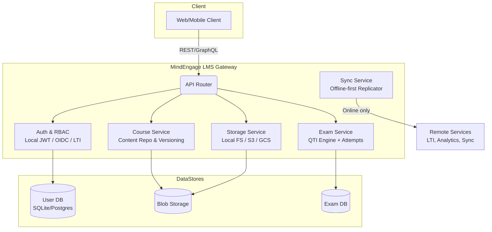
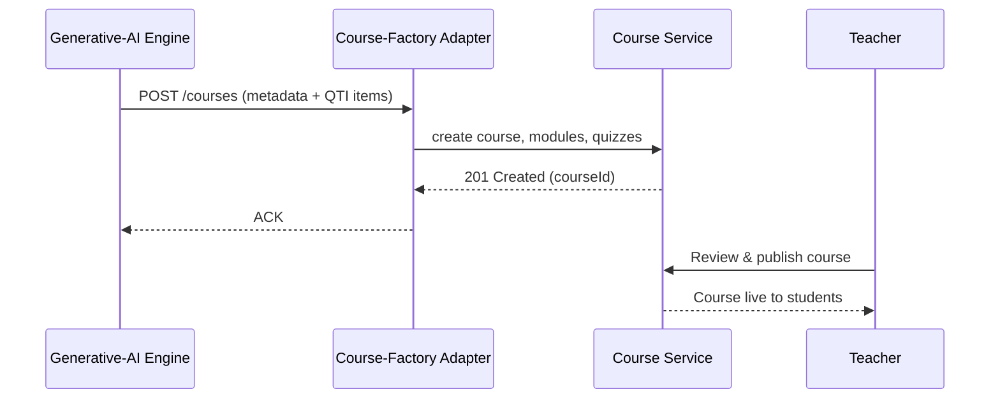
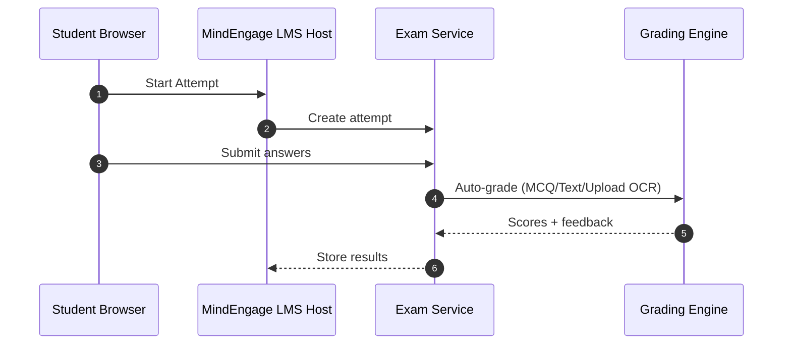

# MindEngage LMS Tool

An AI-first Learning Management System by MindEngage with Canvas-like UX, native Generative-AI content pipelines, and full LTI/QTI/xAPI support — now with **dual online/offline modes** for Internet or LAN deployments.

---

## Overview

MindEngage LMS Tool lets your Generative-AI Course‐Factory publish real courses, modules, and quizzes directly into the system.  
It supports **LAN-only deployments** for secure offline classrooms as well as **Internet-connected online deployments** with full LTI and analytics integrations.

Teachers can review and publish AI‐generated content; students take quizzes and exams with full proctoring hooks; and certification bodies integrate via LTI.

---

## Features

- **Dual Mode**: LAN offline (no Internet) or online mode switchable at runtime.  
- **AI-Driven Content**: Automated import of courses, lessons, quizzes via REST/GraphQL.  
- **Rich Authoring**: Markdown/HTML editor with IMS Common Cartridge export.  
- **Assessments & Exams**: QTI 3.0 engine, randomized pools, proctoring.  
- **LTI 1.3 Advantage**: Deep-Linking, NRPS, AGS for certification & tool interoperability.  
- **Analytics**: xAPI statements to a Learning Record Store (LRS) in online mode.  
- **User Management**: Bulk teacher/admin-initiated student onboarding; role-based enrollments.  
- **Offline Auth**: Local users database or JSON with hashed passwords.  
- **Accessibility**: WCAG 2.2 AA, WAI-ARIA.  
- **Notifications & Calendar**: In-app + email + iCal feeds (online mode).  
- **Extensible Plugin SDK**: Webhooks & serverless functions (WASM/Node).

---

## Architecture

### Dual-Mode Overview

Modes:

    Offline/LAN → No external network calls, all services run locally, sync disabled.

    Online/Internet → External integrations (LTI, xAPI LRS, cloud storage) enabled.

| Feature          | Offline (LAN)               | Online (Internet)         |
| ---------------- | --------------------------- | ------------------------- |
| Login            | Local JWT from user DB/JSON | OIDC / LTI / Local JWT    |
| Course Import    | Local file upload           | AI Course-Factory webhook |
| Exams            | Fully supported             | Fully supported           |
| Asset Storage    | Local FS                    | S3/GCS/MinIO              |
| Sync             | Disabled                    | Enabled                   |
| Analytics (xAPI) | Local DB (optional)         | Cloud LRS                 |
| User Management  | Bulk CSV/JSON API           | Bulk API + remote roster  |

## Course Generation Flow

## Exam & Grading Flow

Offline User Management

Development mode: /auth/login with username=password for rapid testing.

LAN Production mode:

    Use a local SQLite DB or users.json with bcrypt’d passwords.

    Teacher/Admin uploads CSV/JSON roster via POST /users/bulk.

    Server returns credential slips for offline distribution.

    Students can change their own passwords with POST /users/change-password.

Online mode:

    Same bulk import API can be enabled, secured with JWT+RBAC.

    Can force must_change_password on first login.

    Works alongside OIDC/LTI accounts.

Standards & Integrations

| Area                 | Standard / Spec                         |
| -------------------- | --------------------------------------- |
| Course Packaging     | IMS Common Cartridge v1.3               |
| Assessments          | QTI 3.0                                 |
| Analytics            | xAPI (Experience API)                   |
| Rosters & SIS        | OneRoster v1.2                          |
| Tool Launch & Grades | LTI 1.3 Advantage                       |
| Authentication       | OAuth 2.1 / OIDC / SAML 2.0 / Local JWT |
| Accessibility        | WCAG 2.2 AA, WAI-ARIA                   |

